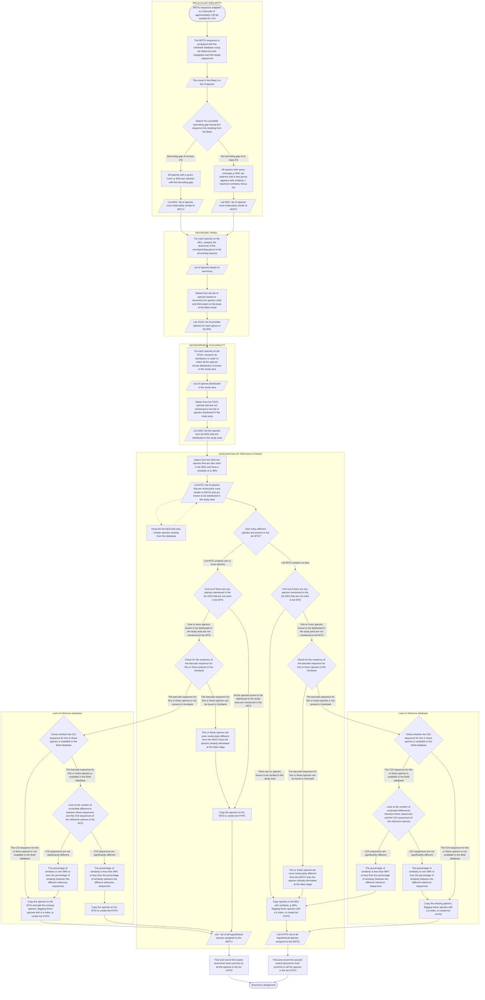

```mermaid

flowchart TB

subgraph A[MOLECULAR SIMILARITY]
    1stadiumId(["`MOTU sequence *adapted to a barcode of approximately 100 bp outside the COI*`"]) ---> 2[The MOTU sequence is compared with the Genbank database using the Blast tool with megablast and 500 target sequences]
    2 ---> 3paraId[/"`The result of the Blast is a list of species`"/]
    3paraId ---> 4decisionId{"`Search for a possible barcoding gap among the sequence list resulting from the Blast`"}
    4decisionId -- Barcoding gap of at least 2% --> 5[All species with a query cover ⩾ 90% are retained until the barcoding gap]
    4decisionId -- No barcoding gap of at least 2% --> 6[All species with query coverage ⩾ 90% are retained until a new genus appears with similarity < maximum similarity minus 2%]
    5 --> 7paraId[/"`List MOL: list of species most molecularly similar to MOTU`"/]
    6 --> 8paraId[/"`List MOL: list of species most molecularly similar to MOTU`"/]
end

subgraph B[TAXONOMIC PANEL]
    7paraId & 8paraId ---> 9[For each species on list MOL, analyse the taxonomy of the corresponding genus to list all existing species]
    9 --> 10paraId[/"`List of species based on taxonomy`"/]
    10paraId ---> 11[Delete from the list of species based on taxonomy the species cited and eliminated on the basis of the Blast result]
    11 --> 12paraId[/"`List TAXO: list of possible species for each genus in list MOL`"/]
end

subgraph C[GEOGRAPHICAL PLAUSIBILITY]
    12paraId --> 13[For each species on list TAXO, research its distribution in order to retain all the species whose distribution is known in the study area]
    13 --> 14paraId[/"`List of species distributed in the study area`"/]
    14paraId --> 15[Delete from list TAXO species that are not mentioned in the list of species distributed in the study area] 
    15 --> 16paraId[/"`List GEO: list the species from list MOL that are distributed in the study area`"/]
end

subgraph D[INTEGRATION OF PREVIOUS STAGES]
   16paraId --> 17[Select from list GEO the species that are also cited in list MOL and have a similarity of ⩾ 98%]
   17 --> 18paraId[/"`List MTG: list of species that are molecularly most similar to MOTU and are known to be distributed in the study area`"/]
   18paraId -.-> 22[Keep the list GEO that may contain species missing from the database]
   22 -.-> 18paraId
   18paraId --> 19decisionId{"`How many different species are present in the list MTG?`"}
   19decisionId -- List MTG contains one or more species --> 20decisionId{"`Find out if there are any species mentioned in the list GEO that are not cited in list MTG`"}
   20decisionId -- One or more species known to be distributed in the study area are not mentioned in list MTG --> 23decisionId{"`Check for the existence of the barcode sequence for this or these species in the Genbank`"}
   23decisionId -- The barcode sequence for this or these species can be found in Genbank --> 200[This or these species are more molecularly different from the MOTU than the species already eliminated at the blast stage]--> 21
   20decisionId -- All the species known to be distributed in the study area are mentioned in list MTG --> 21[Copy the species on list MTG to create list HYPO]

end

subgraph E[Lack of reference database]
   23decisionId -- The barcode sequence for this or these species is not present in Genbank --> 26decisionId{"`Check whether the COI sequence for this or these species is available in the Bold database`"}
   26decisionId -- The COI sequence for this or these species is not available in the Bold database --> 27[Copy the species on list MTG and add the missing species, flagging these species with a a index, to create list HYPO]
   26decisionId -- The barcode sequence for this or these species is available in the Bold database --> 29decisionId{"`Look at the number of nucleotide differences between these sequences and the COI sequences of the reference species in list MTG`"}
   29decisionId -- COI sequences are not significantly different --> 205[The percentage of similarity is over 98% or over the percentage of similarity between the different reference sequences]--> 27
   29decisionId -- COI sequences are significantly different --> 203[The percentage of similarity is less than 98% or less than the percentage of similarity between the different reference sequences] --> 32[Copy the species on list MTG to create list HYPO]
end

subgraph D
   27 --> 22paraId
   32 --> 22paraId

   19decisionId -- List MTG contains no taxa --> 34decisionId{"`Find out if there are any species mentioned in the list GEO that are not cited in list MTG`"}
   34decisionId -- There are no species known to be studied in the study area --> 35[Copy species in list MOL with similarity ⩾ 98%, flagging these species with a b index, to create list HYPO]
   35 --> 42paraId
   34decisionId -- One or more species known to be distributed in the study area are not mentioned in list MTG --> 37decisionId{"`Check for the existence of the barcode sequence for this or these species in the Genbank`"}
   37decisionId -- The barcode sequence for this or these species can be found in Genbank --> 201[This or these species are more molecularly different from the MOTU than the species already eliminated at the blast stage] --> 35
end

subgraph F[Lack of reference database]
   37decisionId -- The barcode sequence for this or these species is not present in Genbank --> 40decisionId{"`Check whether the COI sequence for this or these species is available in the Bold database`"}
   40decisionId -- The COI sequence for this or these species is available in the Bold database --> 43decisionId{"`Look at the number of nucleotide differences between these sequences and the COI sequences of the reference species`"}
   43decisionId -- COI sequences are not significantly different --> 206[The percentage of similarity is over 98% or over the percentage of similarity between the different reference sequences] --> 41
   40decisionId -- The COI sequence for this or these species is not available in the Bold database --> 41[Copy the missing species, flagging these species with a a index, to create list HYPO]
   41 --> 42paraId[/"`List HYPO: list of all hypothetical species assigned to the MOTU`"/]
   43decisionId -- COI sequences are significantly different --> 204[The percentage of similarity is less than 98% or less than the percentage of similarity between the different reference sequences] --> 35
end 

   22paraId --> 48[Find and record the lowest taxonomic level common to all the species in the list HYPO]
   42paraId --> 50[Find and record the second lowest taxonomic level common to all the species in the list HYPO]
   21 --> 22paraId[/"`List : list of all hypothetical species assigned to the MOTU`"/]
   48 --> 49stadiumId(["`Taxonomic assignment`"])
   50 --> 49stadiumId


```
